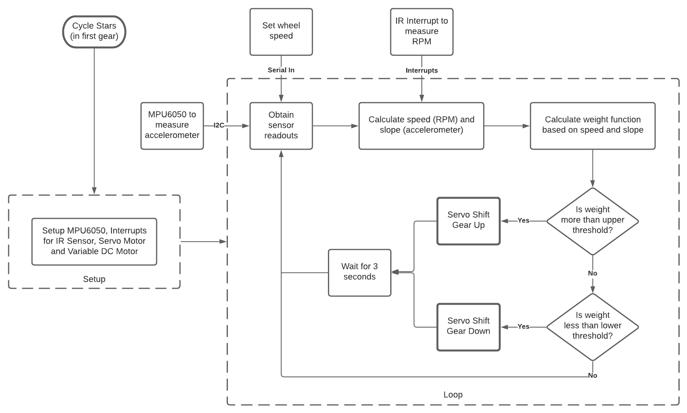

# Automatic Gear Shifter

### Description
An Arduino Uno, an IR sensor, a 6-axis IMU and Servo motors have been employed to
manipulate the 6 gear levels of a rear-wheel geared bicycle. The Arduino will take inputs
from the two sensors and pass the output onto the Servo motor which will manipulate
the gears which in turn affects the input to the Arduino.

The results include the [code](project.ino) in Embedded C, a live demonstration, and the [final presentation](assets/Presentation.pdf).

*Circuit Diagram*

*Flowchart*

To test the code on a gcc compiler, use [`test.cpp`](cpp/test.cpp)

### Dependencies

 - Components:
   - Arduino Uno
   - Servo Motor
   - Infrared Sensor and Receiver
   - 3-Axis Accelerometer (MPU6050)
 - Libraries:
   - Wire.h (for I2C)
   - Servo.h (for the Servo Motor)
   - [MPU6050.h](https://github.com/jarzebski/Arduino-MPU6050) (for MPU6050)

### Contributing

If you would like to contribute to this project, please use the following approach:
 1. Fork the repository to your own user
 2. Create a new branch specific to your new code
 3. Write, test, and commit your new code
 4. Submit a pull request from your branch back to the original source

Try to mimic the structure and code conventions of the existing codebase as much as possible.
I and a few others will review the pull request and comment as needed, and then hopefully merge it.

- - - -

Contributors: Aravind Bharathi, Shyam Iyer

<!-- https://www.youtube.com/watch?v=o7vxsNJ2Uk8 2:50 to 4:10 -->
